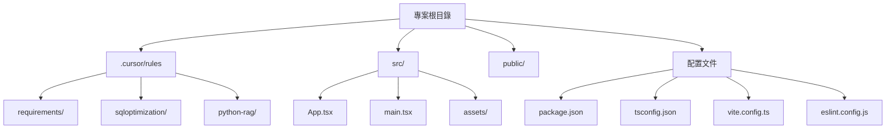
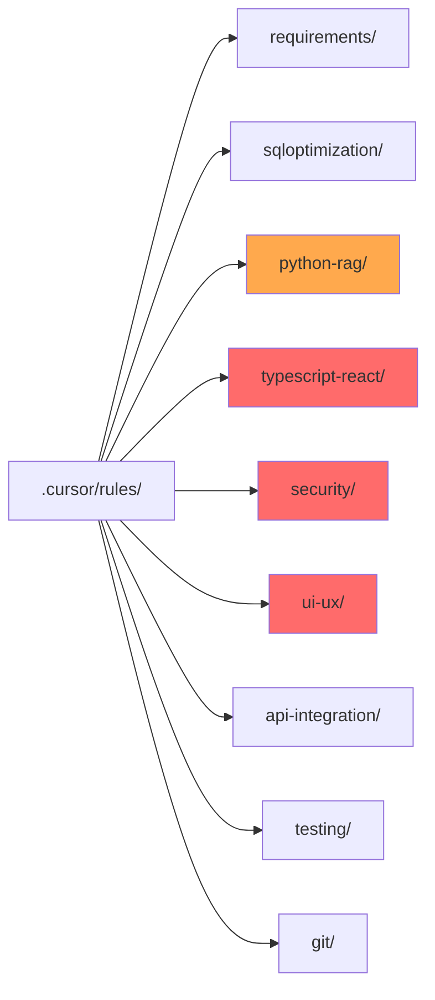

# Gemini FinTech Pro 專案規則完整性分析文件

## 專案概況

### 專案資訊
- **專案名稱**: gemini-fintech
- **技術棧**: React 19 + TypeScript + Vite
- **主要依賴**: 
  - `@google/genai` - Google Gemini AI SDK
  - `tailwindcss` - 樣式框架
  - `framer-motion` - 動畫庫
  - `recharts` - 圖表庫
  - `lucide-react` - 圖標庫

### 專案架構



---

## 現有規則文件分析

### 1. 需求分析規則 (`requirements/RULE.md`)

**狀態**: ✅ 格式正確，結構完整

**內容摘要**:
- 使用 User Story 格式
- 要求明確的驗收標準（Given/When/Then）
- 使用 Markdown 表格定義欄位
- 包含舊系統遷移考量

**適用範圍**: `**/*.md`（僅限 Markdown 文件）
**自動應用**: ❌ 否（`alwaysApply: false`）

**建議**:
- ✅ 規則定義清楚
- ⚠️ 可考慮增加需求優先級（Priority）和相依性（Dependencies）欄位
- ⚠️ 可考慮增加非功能性需求（NFR）的規範

---

### 2. SQL 優化規則 (`sqloptimization/RULE.md`)

**狀態**: ✅ 格式正確，結構完整

**內容摘要**:
- 優先使用 CTEs 而非深層子查詢
- 自動建議 Index 策略
- 多表寫入需使用 Transaction
- 醫療數據敏感欄位加密標註

**適用範圍**: `**/*.sql`（僅限 SQL 文件）
**自動應用**: ❌ 否（`alwaysApply: false`）

**建議**:
- ✅ 規則定義清楚，符合最佳實踐
- ⚠️ **重要**: 金融科技（FinTech）專案應加強合規性規範（PCI DSS、資料保留政策）
- ⚠️ 可增加執行計劃（EXPLAIN）檢查要求
- ⚠️ 可增加資料備份與恢復策略

---

### 3. Python RAG 開發規則 (`python-rag/RULE.md`)

**狀態**: ⚠️ **格式問題** - frontmatter 格式不一致

**內容摘要**:
- 使用 Google Style Docstrings
- 優先使用熟悉庫（pandas, langchain/openai）
- API Key 使用環境變數

**適用範圍**: 未明確指定（建議：`**/*.py`）
**自動應用**: ✅ 是（`alwaysApply: true`）

**發現的問題**:
```yaml
---
description: Python 開發、腳本與 RAG 系統設計
alwaysApply: false  # 第一次定義為 false
---
# Python Development Rules
...
---
alwaysApply: true  # 第二次定義為 true（重複且衝突）
---
```

**建議**:
- 🔴 **立即修正**: 移除重複的 `alwaysApply` 定義
- ⚠️ 應明確指定 `globs`（建議：`**/*.py`）
- ⚠️ 可增加 RAG 特定的最佳實踐（如 chunk size、embedding 模型選擇）
- ⚠️ 可增加錯誤處理與重試機制規範

---

## 缺失的規則文件

### 🔴 高優先級（必須補充）

#### 1. TypeScript/React 開發規則
**理由**: 專案主要為 React + TypeScript，但目前沒有對應規則

**建議內容**:
- TypeScript 類型定義規範（interface vs type）
- React Hooks 使用最佳實踐
- 組件設計原則（單一職責、可重用性）
- 狀態管理策略
- Props 類型定義要求

**建議位置**: `.cursor/rules/typescript-react/RULE.md`

---

#### 2. 前端安全性規則
**理由**: 金融科技專案涉及敏感數據，安全性至關重要

**建議內容**:
- API Key 與敏感資料處理
- XSS/CSRF 防護
- 資料加密與傳輸安全（HTTPS）
- 用戶資料隱私保護（GDPR/個資法）
- 金融資料合規性（PCI DSS）

**建議位置**: `.cursor/rules/security/RULE.md`

---

#### 3. UI/UX 規則
**理由**: 專案使用了 Tailwind CSS、Framer Motion 等 UI 庫

**建議內容**:
- Tailwind CSS 使用規範（class 命名、響應式設計）
- 動畫與過渡效果原則
- 無障礙設計（a11y）要求
- 響應式設計斷點標準
- 圖表（Recharts）使用規範

**建議位置**: `.cursor/rules/ui-ux/RULE.md`

---

### 🟡 中優先級（建議補充）

#### 4. API 整合規則
**理由**: 專案使用 Google Gemini AI SDK，未來可能有更多 API 整合

**建議內容**:
- API 調用錯誤處理
- 請求頻率限制（Rate Limiting）
- 超時與重試策略
- API 回應資料驗證
- 環境變數管理

**建議位置**: `.cursor/rules/api-integration/RULE.md`

---

#### 5. 測試規則
**理由**: 金融科技專案需要高品質保證

**建議內容**:
- 單元測試覆蓋率要求
- 測試檔案命名規範
- Mock 資料使用原則
- E2E 測試策略

**建議位置**: `.cursor/rules/testing/RULE.md`

---

#### 6. Git 提交規則
**理由**: 維護程式碼歷史可追蹤性

**建議內容**:
- Commit message 格式（Conventional Commits）
- Branch 命名規範
- PR 審查檢查清單

**建議位置**: `.cursor/rules/git/RULE.md`

---

## 規則文件格式標準化

### 標準格式模板

```markdown
---
description: [規則描述，簡短說明此規則的用途]
alwaysApply: [true|false]
globs: [檔案匹配模式，如 **/*.ts, **/*.tsx]
---

# [規則標題]

## 概述
[規則的詳細說明與背景]

## 規範項目

### 1. [規範項目 1]
- **要求**: [具體要求]
- **範例**: 
  ```[語言]
  // 正確範例
  ```
- **反例**:
  ```[語言]
  // 錯誤範例
  ```

### 2. [規範項目 2]
...

## 特殊考量
[針對此專案的特殊要求，如金融科技合規性]

## 參考資源
[相關文檔或標準的連結]
```

---

## 規則文件架構建議



---

## 完整性評分

| 類別 | 完整性 | 評分 | 備註 |
|------|--------|------|------|
| 需求分析 | ✅ 完整 | 90% | 格式正確，可增加 NFR 規範 |
| SQL 優化 | ✅ 完整 | 85% | 需加強 FinTech 合規性考量 |
| Python/RAG | ⚠️ 需修正 | 70% | 格式問題需立即修正 |
| TypeScript/React | 🔴 缺失 | 0% | **必須補充** |
| 安全性 | 🔴 缺失 | 0% | **必須補充**（FinTech 關鍵） |
| UI/UX | 🔴 缺失 | 0% | **必須補充** |
| API 整合 | 🟡 建議 | 0% | 建議補充 |
| 測試 | 🟡 建議 | 0% | 建議補充 |
| Git | 🟡 建議 | 0% | 建議補充 |

**整體完整性**: 27% (3/11 類別完整)

---

## 優先處理事項

### 🔴 緊急（本週內）
1. **修正 `python-rag/RULE.md` 格式問題**
2. **創建 `typescript-react/RULE.md`**
3. **創建 `security/RULE.md`**

### 🟡 重要（本月底前）
4. **創建 `ui-ux/RULE.md`**
5. **創建 `api-integration/RULE.md`**
6. **更新 `sqloptimization/RULE.md` 增加 FinTech 合規性**

### 🟢 建議（下個月）
7. **創建 `testing/RULE.md`**
8. **創建 `git/RULE.md`**
9. **完善 `requirements/RULE.md` 增加 NFR 規範**

---

## 規則應用策略建議

### 自動應用（alwaysApply: true）
以下規則應設定為自動應用，確保程式碼品質：

- ✅ `python-rag/RULE.md` (已設定)
- ✅ `security/RULE.md` (建議新增)
- ✅ `typescript-react/RULE.md` (建議新增)

### 條件應用（alwaysApply: false）
以下規則應根據檔案類型自動觸發：

- ✅ `requirements/RULE.md` (globs: `**/*.md`)
- ✅ `sqloptimization/RULE.md` (globs: `**/*.sql`)
- ✅ `typescript-react/RULE.md` (globs: `**/*.{ts,tsx}`)
- ✅ `ui-ux/RULE.md` (globs: `**/*.{tsx,css}`)

---

## 附錄：規則文件檢查清單

當創建新規則文件時，請確認：

- [ ] Frontmatter 格式正確（無重複定義）
- [ ] `description` 欄位已填寫
- [ ] `alwaysApply` 欄位已設定
- [ ] `globs` 欄位已定義（如適用）
- [ ] 規則說明清晰明確
- [ ] 包含正確與錯誤範例
- [ ] 考慮專案特殊需求（FinTech 合規性）

---

**文件版本**: 1.0  
**最後更新**: 2025-12-16  
**維護者**: System Analyst Team


