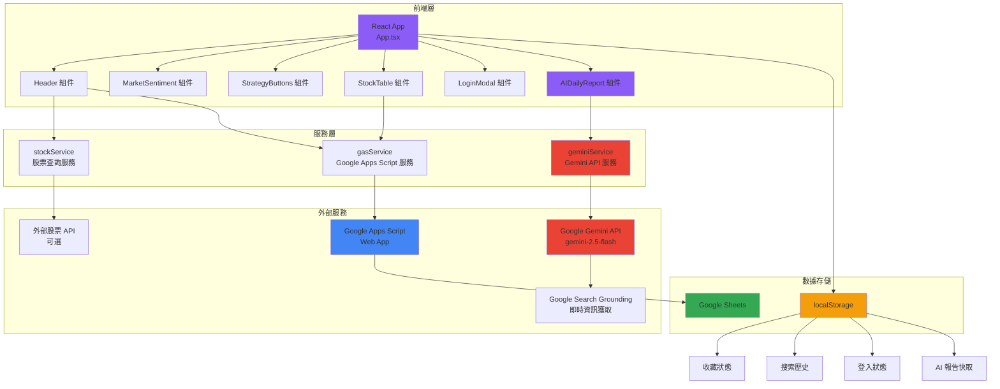
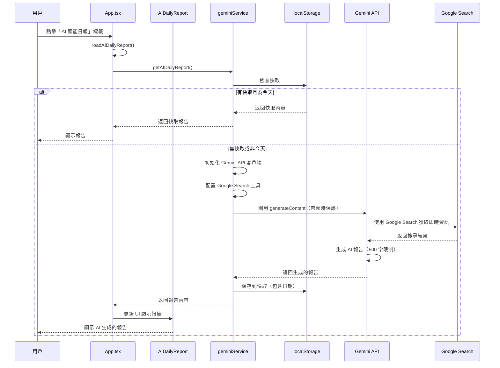
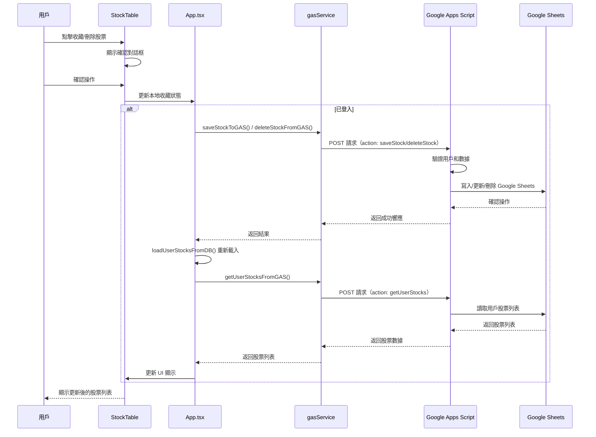
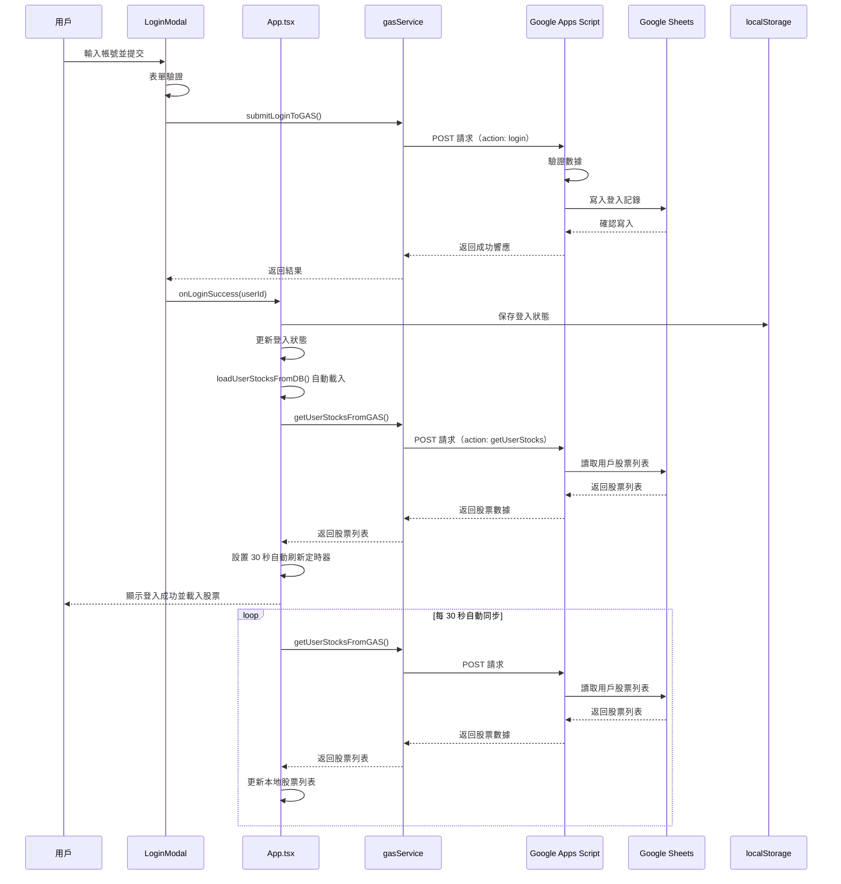
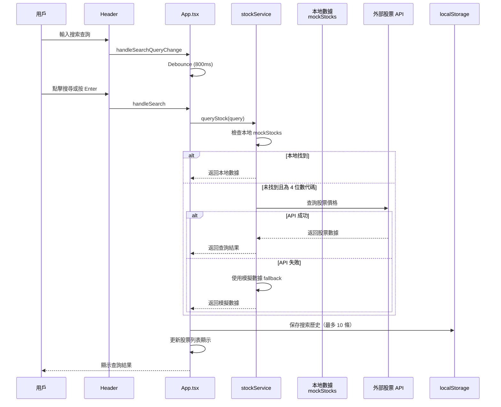
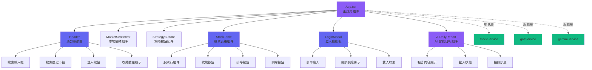

# Gemini FinTech Pro

**一個現代化的股票資訊管理系統，整合 AI 分析和用戶登入功能**

---

## 📋 目錄

- [專案簡介](#專案簡介)
- [技術棧](#技術棧)
- [功能列表](#功能列表)
- [技術架構](#技術架構)
- [快速開始](#快速開始)
- [環境配置](#環境配置)
- [部署指南](#部署指南)
- [專案結構](#專案結構)
- [開發規範](#開發規範)
- [故障排除](#故障排除)

---

## 🎯 專案簡介

Gemini FinTech Pro 是一個基於 React + TypeScript 構建的現代化股票資訊管理系統，提供即時股票價格查詢、市場情緒分析、策略篩選、AI 智能日報和用戶登入等功能。系統採用深色主題設計，支持響應式佈局，並整合 Google Apps Script 作為後端服務，以及 Google Gemini API 提供 AI 智能分析能力。

### 主要特性

- ✅ **即時股票查詢**: 支持本地數據和外部 API 查詢
- ✅ **AI 智能日報**: 使用 Gemini 2.5 Flash 模型生成每日股市報告，整合 Google Search 獲取即時資訊
- ✅ **市場情緒分析**: 視覺化市場情緒指標
- ✅ **策略篩選**: 多種投資策略過濾（多頭排列、法人抬轎、軋空警訊）
- ✅ **用戶登入系統**: 整合 Google Apps Script 存儲用戶資料
- ✅ **用戶股票數據庫**: 登入後可保存/刪除股票到資料庫，自動同步功能
- ✅ **數據持久化**: 使用 localStorage 保存收藏、搜索歷史、登入狀態和 AI 報告快取
- ✅ **響應式設計**: 適配各種屏幕尺寸
- ✅ **動畫效果**: 使用 Framer Motion 提供流暢的用戶體驗

---

## 🛠 技術棧

### 前端框架

- **React 19.2.0**: 現代化的 UI 框架
- **TypeScript 5.9.3**: 類型安全的 JavaScript
- **Vite 7.2.5 (rolldown-vite)**: 快速的構建工具

### UI 框架與樣式

- **Tailwind CSS 4.1.18**: 實用優先的 CSS 框架
- **Framer Motion 12.23.26**: 動畫庫
- **Lucide React 0.561.0**: 圖標庫

### 數據可視化

- **Recharts 3.5.1**: 圖表庫

### 後端服務

- **Google Apps Script**: 無服務器後端，存儲登入記錄和用戶股票數據庫到 Google Sheets
- **Google Gemini API (@google/genai 1.33.0)**: AI 智能分析服務，使用 gemini-2.5-flash 模型
- **Google Search Grounding**: 即時資訊獲取工具，整合到 Gemini API 中

### 部署

- **GitHub Pages**: 靜態網站託管
- **GitHub Actions**: 自動化部署流程

### 開發工具

- **ESLint**: 代碼質量檢查
- **TypeScript ESLint**: TypeScript 專用規則

---

## ✨ 功能列表

### 1. 股票管理功能

#### 股票列表顯示
- ✅ 表格形式顯示股票資訊
- ✅ 顯示股票代碼、名稱、價格、漲跌幅、成交量
- ✅ 支持排名顯示
- ✅ 響應式表格設計

#### 股票搜索
- ✅ 實時搜索（支持股票代碼和名稱）
- ✅ 800ms debounce 機制，減少 API 調用
- ✅ 搜索歷史記錄（最多 10 條）
- ✅ 自動查詢 4 位數股票代碼（台灣股票）
- ✅ 本地數據和 API 查詢結合
- ✅ 載入狀態和錯誤提示

#### 股票收藏
- ✅ 一鍵收藏/取消收藏
- ✅ 收藏狀態持久化（localStorage）
- ✅ 收藏數量顯示在 Header
- ✅ 登入後自動同步到資料庫（Google Sheets）

### 2. 策略篩選功能

- ✅ **所有策略**: 顯示所有股票
- ✅ **多頭排列**: 篩選價格上漲的股票 (`change > 0`)
- ✅ **法人抬轎**: 篩選大戶持股比例 > 60% 的股票
- ✅ **軋空警訊**: 篩選價格上漲且成交量 > 4000萬 的股票

### 3. 排序功能

支持多種排序方式：

- ✅ **預設排序**: 按排名排序
- ✅ **名稱排序**: 按股票名稱升序/降序
- ✅ **價格排序**: 按當前價格升序/降序
- ✅ **漲跌幅排序**: 按價格變化百分比升序/降序
- ✅ **成交量排序**: 按成交量升序/降序

### 4. 市場情緒分析

- ✅ 市場情緒指數顯示
- ✅ 視覺化情緒等級（極度恐慌、恐慌、中性、貪婪、極度貪婪）
- ✅ 使用 Recharts 顯示圖表

### 5. 用戶登入系統

#### 登入功能
- ✅ 帳號登入表單
- ✅ 表單驗證
- ✅ 載入狀態顯示
- ✅ 錯誤處理和提示
- ✅ 登入狀態持久化

#### 後端整合
- ✅ Google Apps Script Web App 整合
- ✅ 登入記錄寫入 Google Sheets
- ✅ 配置狀態檢查和提示
- ✅ 詳細的錯誤診斷

#### 用戶股票數據庫
- ✅ 登入後自動載入用戶股票列表
- ✅ 保存股票到資料庫（saveStockToGAS）
- ✅ 從資料庫刪除股票（deleteStockFromGAS）
- ✅ 獲取用戶股票列表（getUserStocksFromGAS）
- ✅ 每 30 秒自動刷新資料庫股票清單

### 6. UI/UX 功能

#### 標籤導航
- ✅ **金額排行**: 股票排行榜
- ✅ **AI 智能日報**: AI 分析功能（已實現）
- ✅ **國際盤**: 國際市場數據（預留）

### 7. AI 智能日報功能

- ✅ **AI 智能日報**: 使用 Gemini 2.5 Flash 模型生成每日股市報告
- ✅ **Google Search 整合**: 獲取即時股市資訊，確保報告內容最新
- ✅ **智能快取機制**: 同一天內只呼叫一次 API，節省成本並提升性能
- ✅ **報告內容限制**: 500 字以內，確保內容精簡實用
- ✅ **錯誤處理和重試機制**: 完善的錯誤處理，確保用戶體驗
- ✅ **載入狀態顯示**: 清晰的載入提示和錯誤訊息

### 8. 用戶股票數據庫功能

#### 股票收藏與資料庫同步
- ✅ **登入後保存股票**: 收藏時自動寫入資料庫
- ✅ **刪除股票功能**: 支持從資料庫中刪除股票
- ✅ **自動同步機制**: 每 30 秒自動刷新資料庫股票清單
- ✅ **即時更新**: 收藏/刪除操作後立即同步到資料庫
- ✅ **數據持久化**: 用戶股票數據存儲在 Google Sheets 中

#### 鍵盤快捷鍵
- ✅ `Ctrl/Cmd + K`: 打開搜索框
- ✅ `ESC`: 清除搜索查詢

#### 動畫效果
- ✅ 搜索框展開/收起動畫
- ✅ 列表項進入動畫
- ✅ 按鈕懸停效果
- ✅ 模態框出現/消失動畫
- ✅ 錯誤訊息滑入動畫

---

## 🏗 技術架構

### 完整系統架構圖



### AI 智能日報流程圖



### 用戶股票數據庫流程圖



### 登入與數據同步流程圖



### 股票搜索流程圖



### 組件層級結構圖



---

## 🚀 快速開始

### 前置要求

- **Node.js**: >= 20.x
- **npm**: >= 9.x
- **Git**: 用於版本控制

### 安裝步驟

1. **克隆倉庫**

```bash
git clone https://github.com/qwerboy-design/gemini-fintech-pro.git
cd gemini-fintech-pro
```

2. **安裝依賴**

```bash
npm install
```

3. **配置環境變數**

```bash
# 複製環境變數範本
cp .env.example .env

# 編輯 .env 文件，填入實際值
# VITE_GAS_URL=您的_Google_Apps_Script_URL
# VITE_GEMINI_API_KEY=您的_Gemini_API_Key（AI 功能必需）
```

4. **啟動開發服務器**

```bash
npm run dev
```

5. **訪問應用**

打開瀏覽器訪問: http://localhost:5173

---

## ⚙️ 環境配置

### 環境變數說明

創建 `.env` 文件（基於 `.env.example`）：

```env
# Google Apps Script Web App URL
# 從 Google Apps Script 部署後獲取的 URL
VITE_GAS_URL=https://script.google.com/macros/s/YOUR_DEPLOYMENT_ID/exec

# Google Gemini AI API Key（已移至 Google Apps Script Script Properties）
# 不再需要在此設置，請在 Google Apps Script 的 Script Properties 中設置 GEMINI_API_KEY
# 詳細說明請參考：GEMINI_API_SECURITY_FIX.md

# FinMind API Key（可選，用於台股即時報價功能）
# 獲取方式：前往 https://finmindtrade.com/ 註冊並獲取 API Key
# 注意：即時資訊功能需要贊助會員
VITE_FINMIND_API_KEY=your_finmind_api_key_here

# Finnhub API Key（可選，用於 Fear and Greed Index）
# 獲取方式：前往 https://finnhub.io/ 註冊並獲取 API Key
VITE_FINNHUB_API_KEY=your_finnhub_api_key_here
```

### 環境變數驗證

運行診斷工具檢查配置：

```bash
node check-env.js
```

### Google Apps Script 配置

詳細配置步驟請參考: [`GOOGLE_APPS_SCRIPT_SETUP.md`](./GOOGLE_APPS_SCRIPT_SETUP.md)

**快速步驟**:
1. 創建 Google Sheet 並獲取 Sheet ID
2. 創建 Google Apps Script 專案
3. 複製 `google-apps-script/Code.gs` 到編輯器
4. 更新 `SHEET_ID` 和 `SHEET_NAME`
5. 運行 `initializeSheet()` 函數
6. 部署為 Web App（權限：任何人）
7. 複製部署 URL 到 `.env` 文件

---

## 📦 部署指南

### 本地構建

```bash
# 構建生產版本
npm run build

# 預覽構建結果
npm run preview
```

### 部署到 GitHub Pages

#### 方式 1: 手動部署

```bash
npm run deploy
```

#### 方式 2: 自動部署（GitHub Actions）

1. **推送代碼到 `main` 分支**:
   ```bash
   git add .
   git commit -m "更新功能"
   git push origin main
   ```

2. **GitHub Actions 會自動**:
   - 構建專案
   - 部署到 GitHub Pages

詳細說明: [`GITHUB_ACTIONS_DEPLOYMENT.md`](./GITHUB_ACTIONS_DEPLOYMENT.md)

### 生產環境配置

**重要**: GitHub Pages 不會讀取本地 `.env` 文件，需要在 GitHub Secrets 中設置環境變數。

**詳細設置指南**: 請參考 [`GITHUB_SECRETS_SETUP.md`](./GITHUB_SECRETS_SETUP.md)  
**快速設置指南**: 請參考 [`GITHUB_SECRETS_QUICK_START.md`](./GITHUB_SECRETS_QUICK_START.md)

**快速設置步驟**:
1. 前往: https://github.com/qwerboy-design/gemini-fintech-pro/settings/secrets/actions
2. 點擊 "New repository secret"，添加：
   - Name: `VITE_GAS_URL`
   - Value: `https://script.google.com/macros/s/AKfycbzoEKE_10KGmlx8DfLgPa1SohOUYhrxuwmCHJRMogTkarwBL9NBAjBmP23JgRVE_GUk/exec`
3. 觸發重新部署（推送更改或手動觸發工作流程）

---

## 📁 專案結構

```
gemini-fintech-pro/
├── .github/
│   └── workflows/
│       └── deploy.yml              # GitHub Actions 自動部署配置
├── .cursor/
│   └── rules/                      # Cursor IDE 規則配置
│       ├── requirements/
│       ├── sqloptimization/
│       └── python-rag/
├── google-apps-script/
│   └── Code.gs                     # Google Apps Script 後端代碼
├── public/                         # 靜態資源
├── src/
│   ├── components/                 # React 組件
│   │   ├── Header.tsx              # 頂部導航欄
│   │   ├── LoginModal.tsx          # 登入模態框
│   │   ├── MarketSentiment.tsx     # 市場情緒組件
│   │   ├── StockTable.tsx          # 股票表格
│   │   ├── StrategyButtons.tsx     # 策略按鈕
│   │   └── AIDailyReport.tsx       # AI 智能日報組件
│   ├── data/                       # 數據文件
│   │   └── mockStocks.ts           # 模擬股票數據
│   ├── services/                   # 服務層
│   │   ├── gasService.ts           # Google Apps Script 服務
│   │   ├── stockService.ts         # 股票查詢服務
│   │   └── geminiService.ts        # Gemini API 服務
│   ├── types/                      # TypeScript 類型定義
│   │   └── stock.ts                # 股票相關類型
│   ├── App.tsx                     # 主應用組件
│   ├── App.css                     # 應用樣式
│   ├── index.css                   # 全局樣式
│   └── main.tsx                    # 應用入口
├── .env.example                    # 環境變數範本
├── .gitignore                      # Git 忽略配置
├── check-env.js                    # 環境變數診斷工具
├── eslint.config.js                # ESLint 配置
├── index.html                      # HTML 模板
├── package.json                    # 專案配置
├── tsconfig.json                   # TypeScript 配置
├── tsconfig.app.json               # TypeScript 應用配置
├── tsconfig.node.json              # TypeScript Node 配置
├── vite.config.ts                  # Vite 配置
└── README.md                       # 專案說明（本文件）
```

---

## 🧑‍💻 開發規範

### 代碼風格

#### TypeScript

- ✅ 嚴格模式 (`strict: true`)
- ✅ 使用 Type Hints 定義所有函數參數和返回值
- ✅ 優先使用 `interface` 而非 `type`（除非需要聯合類型）
- ✅ 避免使用 `any`，優先使用 `unknown` 或具體類型

#### React 組件

- ✅ 使用函數式組件和 Hooks
- ✅ 組件使用 PascalCase 命名
- ✅ Props 使用 interface 定義
- ✅ 使用 TypeScript 嚴格檢查

#### 文件命名

- ✅ 組件文件: `PascalCase.tsx` (例如: `Header.tsx`)
- ✅ 工具文件: `camelCase.ts` (例如: `stockService.ts`)
- ✅ 類型文件: `camelCase.ts` (例如: `stock.ts`)

### 狀態管理

- ✅ 使用 React Hooks (`useState`, `useEffect`, `useMemo`, `useRef`)
- ✅ 複雜狀態使用 `useReducer`（如需要）
- ✅ 持久化數據使用 `localStorage`
- ✅ 避免不必要的重新渲染

### 錯誤處理

- ✅ 使用 `try-catch` 捕獲異步錯誤
- ✅ 捕獲特定異常類型，避免 bare `catch`
- ✅ 提供友好的錯誤訊息給用戶
- ✅ 記錄錯誤到控制台（開發環境）

### 性能優化

- ✅ 使用 `useMemo` 緩存計算結果
- ✅ 使用 `useCallback` 緩存函數引用
- ✅ 列表渲染使用唯一的 `key`
- ✅ Debounce 搜索輸入（800ms）
- ✅ 避免在渲染中進行昂貴計算

---

## 🔍 功能詳細說明

### 1. 股票搜索功能

#### 搜索機制

```typescript
// 搜索優先級
1. 本地數據查找（即時）
2. API 查詢（4位數股票代碼，帶 debounce）
3. 模擬數據 fallback（API 失敗時）
```

#### 支持的查詢方式

- **股票代碼**: `2330`（台積電）
- **股票名稱**: `台積電` 或 `台積`
- **部分匹配**: 支持部分名稱搜索

### 2. 數據持久化

#### localStorage 鍵值

- `gemini-fintech-favorites`: 收藏的股票代碼數組
- `gemini-fintech-search-history`: 搜索歷史數組（最多 10 條）
- `gemini-fintech-user`: 當前登入用戶 ID
- `gemini-fintech-ai-daily-report`: AI 報告快取（包含內容和日期）

#### 數據格式

```typescript
// 收藏
["2330", "2317", "2454"]

// 搜索歷史
["2330", "2317", "2454"]

// 登入用戶
"mike"
```

### 3. API 整合

#### 股票查詢 API

- **優先級 1**: 本地 mockStocks 數據
- **優先級 2**: 外部 API（taiwanstock.online, FinMind 等）
- **Fallback**: 模擬數據生成

#### Google Apps Script API

- **端點**: 從環境變數 `VITE_GAS_URL` 讀取
- **方法**: POST
- **請求格式**:
  ```json
  {
    "action": "login",
    "userId": "mike",
    "timestamp": "2025-12-16T10:00:00Z"
  }
  ```
- **支持的 Actions**:
  - `login`: 用戶登入
  - `saveStock`: 保存股票到資料庫
  - `deleteStock`: 從資料庫刪除股票
  - `getUserStocks`: 獲取用戶股票列表

#### Google Gemini API

- **模型**: gemini-2.5-flash
- **工具**: Google Search（用於即時資訊獲取）
- **快取機制**: 同一天內只呼叫一次 API，節省成本
- **內容限制**: 報告內容限制在 500 字以內
- **錯誤處理**: 完善的錯誤處理和重試機制
- **超時保護**: API 調用帶有超時保護機制
- **API Key**: 從環境變數 `VITE_GEMINI_API_KEY` 讀取

---

## 🐛 故障排除

### 常見問題

#### 1. 環境變數未生效

**問題**: 修改 `.env` 後應用仍讀取舊值

**解決方案**:
```bash
# 重啟開發服務器
# 按 Ctrl+C 停止
npm run dev
```

#### 2. Google Apps Script "Failed to fetch" 錯誤

**問題**: 登入時顯示網絡錯誤（無論使用帳號 ID 或郵件都無法登入）

**⚠️ 最常見原因**: Google Apps Script 部署權限未設置為「任何人」

**快速解決方案**:
1. **前往 Google Apps Script**: https://script.google.com
2. **打開專案** → 「部署」→ 「管理部署」
3. **點擊「編輯」** → **設置「具有存取權的使用者」為「任何人」**
4. **重新部署** → 複製新的 URL → 更新 `.env` 文件
5. **重啟開發服務器**

**詳細步驟**: 請參考 [`LOGIN_TROUBLESHOOTING.md`](./LOGIN_TROUBLESHOOTING.md)（包含完整診斷步驟）

**其他可能原因**:
- URL 格式錯誤（必須以 `/exec` 結尾）
- 環境變數未正確載入（需要重啟服務器）
- 網絡或防火牆問題
- Google Apps Script 代碼錯誤

**診斷工具**:
```bash
node check-env.js
```

#### 3. 構建失敗

**問題**: `npm run build` 失敗

**解決方案**:
```bash
# 清除 node_modules 和重新安裝
rm -rf node_modules
npm install

# 檢查 TypeScript 錯誤
npm run lint
```

#### 4. GitHub Pages 404 錯誤

**問題**: 部署後網站顯示 404

**解決方案**:
1. 確認 `vite.config.ts` 中 `base` 路徑正確
2. 檢查 GitHub Pages 設置（分支: `gh-pages`, 目錄: `/ (root)`）
3. 清除瀏覽器快取

詳細故障排除: 參考 [`DEPLOYMENT.md`](./DEPLOYMENT.md)

---

## 📚 相關文檔

### 配置指南

- [`GOOGLE_APPS_SCRIPT_SETUP.md`](./GOOGLE_APPS_SCRIPT_SETUP.md): Google Apps Script 設置詳解
- [`GAS_CONFIGURATION_DIAGNOSTIC.md`](./GAS_CONFIGURATION_DIAGNOSTIC.md): 配置診斷指南
- [`CREATE_ENV_GUIDE.md`](./CREATE_ENV_GUIDE.md): 環境變數創建指南

### 部署文檔

- [`DEPLOYMENT.md`](./DEPLOYMENT.md): 詳細部署指南
- [`DEPLOYMENT_QUICK_START.md`](./DEPLOYMENT_QUICK_START.md): 快速部署指南
- [`GITHUB_ACTIONS_DEPLOYMENT.md`](./GITHUB_ACTIONS_DEPLOYMENT.md): GitHub Actions 自動部署
- [`GITHUB_SECRETS_SETUP.md`](./GITHUB_SECRETS_SETUP.md): **GitHub Secrets 詳細設置指南**（生產環境必讀）
- [`GITHUB_SECRETS_QUICK_START.md`](./GITHUB_SECRETS_QUICK_START.md): GitHub Secrets 快速設置指南

### 功能實現

- [`IMPLEMENTATION_SUMMARY.md`](./IMPLEMENTATION_SUMMARY.md): 股票清單功能實現
- [`BUTTON_FEATURES.md`](./BUTTON_FEATURES.md): 按鈕功能實現
- [`LOGIN_FEATURE_IMPLEMENTATION.md`](./LOGIN_FEATURE_IMPLEMENTATION.md): 登入功能實現
- [`STOCK_SEARCH_API.md`](./STOCK_SEARCH_API.md): 股票查詢 API 實現

### 安全與最佳實踐

- [`SECURITY_BEST_PRACTICES.md`](./SECURITY_BEST_PRACTICES.md): 安全最佳實踐
- [`LOGIN_CONFIGURATION_VERIFICATION.md`](./LOGIN_CONFIGURATION_VERIFICATION.md): 登入配置驗證
- [`LOGIN_TROUBLESHOOTING.md`](./LOGIN_TROUBLESHOOTING.md): **登入功能故障排除完整指南**（推薦閱讀）

---

## 🧪 測試

### 本地測試

```bash
# 啟動開發服務器
npm run dev

# 在瀏覽器中測試以下功能：
# 1. 搜索股票（輸入 "2330"）
# 2. 收藏/取消收藏股票
# 3. 切換策略按鈕
# 4. 排序功能
# 5. 登入功能（需要配置 GAS）
```

### 環境變數驗證

```bash
# 運行診斷工具
node check-env.js
```

### 構建驗證

```bash
# 檢查構建是否成功
npm run build

# 預覽構建結果
npm run preview
```

---

## 📊 專案統計

### 構建大小

- **HTML**: ~0.53 kB (gzip: 0.31 kB)
- **CSS**: ~22.82 kB (gzip: 5.52 kB)
- **JavaScript**: ~334.73 kB (gzip: 106.89 kB)
- **構建時間**: ~350ms

### 代碼統計

- **組件數量**: 6 個主要組件（新增 AIDailyReport）
- **服務數量**: 3 個服務（stockService, gasService, geminiService）
- **類型定義**: 3 個主要 interface
- **模擬數據**: 8+ 支股票數據

---

## 🔮 未來規劃

### 短期改進

- [ ] 優化策略過濾邏輯（更複雜的條件）
- [ ] 添加更多排序選項
- [ ] 改善搜索算法

### 中期改進

- [ ] 整合真實股票 API（支持即時價格）
- [ ] 添加股票詳細頁面
- [ ] 添加技術指標圖表
- [ ] 優化 AI 報告內容和格式

### 長期規劃

- [ ] 用戶投資組合管理
- [ ] WebSocket 即時價格更新
- [ ] 多語言支持
- [ ] 移動端 App（React Native）

---

## 🤝 貢獻指南

### 開發流程

1. Fork 本倉庫
2. 創建功能分支 (`git checkout -b feature/AmazingFeature`)
3. 提交更改 (`git commit -m 'Add some AmazingFeature'`)
4. 推送到分支 (`git push origin feature/AmazingFeature`)
5. 開啟 Pull Request

### 代碼提交規範

- `feat`: 新功能
- `fix`: 修復錯誤
- `docs`: 文檔更新
- `style`: 代碼格式調整
- `refactor`: 代碼重構
- `test`: 測試相關
- `chore`: 構建/工具相關

---

## 📄 許可證

本專案採用 MIT 許可證。

---

## 📞 聯繫方式

如有問題或建議，請通過以下方式聯繫：

- **GitHub Issues**: https://github.com/qwerboy-design/gemini-fintech-pro/issues
- **倉庫**: https://github.com/qwerboy-design/gemini-fintech-pro

---

## ✅ 開發檢查清單

### 本地開發

- [x] Node.js 環境配置
- [x] 依賴安裝
- [x] 環境變數配置
- [x] 開發服務器運行

### 功能實現

- [x] 股票列表顯示
- [x] 搜索功能
- [x] 收藏功能
- [x] 排序功能
- [x] 策略篩選
- [x] 市場情緒顯示
- [x] 登入功能
- [x] 數據持久化

### 部署

- [x] 本地構建測試
- [x] GitHub Pages 部署
- [x] GitHub Actions 自動部署
- [ ] GitHub Secrets 配置（生產環境）

---

**最後更新**: 2025-12-18  
**版本**: 1.0.0  
**狀態**: ✅ 生產就緒
