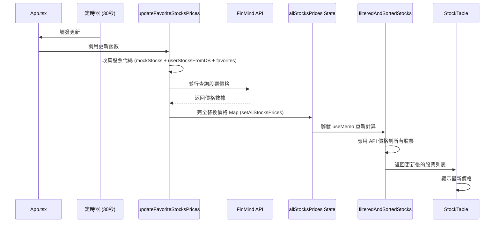

# 股票價格更新功能改善文檔

## 概述

本文檔說明股票價格更新功能的實現方式和改善措施，確保所有顯示的股票都能正確顯示從 FinMind API 獲取的最新收盤價。

## 改善目標

1. **價格更新範圍擴展**：從僅更新收藏股票擴展到更新所有顯示的股票
2. **API 查詢優化**：只查詢必要的股票（股票清單和收藏股票），避免不必要的 API 調用
3. **價格數據管理**：完全替換舊價格，確保顯示最新數據
4. **去重機制**：確保每個股票代碼只出現一次，避免重複顯示

## 技術實現

### 1. 價格更新邏輯

**位置**：`src/App.tsx` - `updateFavoriteStocksPrices` 函數

**實現方式**：

```typescript
const updateFavoriteStocksPrices = useCallback(async () => {
  // 獲取需要更新價格的股票代碼列表
  // 1. 股票清單：mockStocks + userStocksFromDB（去重）
  // 2. 收藏的股票（favorites）
  // 注意：不查詢 queriedStocks，因為這些是臨時查詢結果
  const symbolsToUpdate = new Set<string>();
  
  // 1. 添加股票清單中的股票（mockStocks + userStocksFromDB）
  mockStocks.forEach(stock => symbolsToUpdate.add(stock.symbol));
  userStocksFromDB.forEach(stock => symbolsToUpdate.add(stock.symbol));
  
  // 2. 添加收藏的股票
  favorites.forEach(symbol => symbolsToUpdate.add(symbol));

  if (symbolsToUpdate.size === 0) {
    return;
  }

  setIsLoadingFavoritePrices(true);

  try {
    const symbolsArray = Array.from(symbolsToUpdate);
    const prices = await getStockQuotes(symbolsArray);
    
    // 完全替換價格 Map，清除舊的價格數據，只保留最新的
    setAllStocksPrices(new Map(prices));
    
    if (import.meta.env.DEV) {
      console.log(`成功更新 ${prices.size} 筆股票價格（共 ${symbolsArray.length} 筆請求）`);
    }
  } catch (error) {
    console.error('更新股票價格失敗:', error);
  } finally {
    setIsLoadingFavoritePrices(false);
  }
}, [userStocksFromDB, favorites]);
```

**關鍵改善點**：

- **查詢範圍優化**：只查詢股票清單（`mockStocks` + `userStocksFromDB`）和收藏股票，不查詢臨時搜尋結果（`queriedStocks`）
- **價格數據替換**：使用 `setAllStocksPrices(new Map(prices))` 完全替換舊價格，而不是合併，確保顯示最新數據
- **自動更新機制**：每 30 秒自動更新一次價格

### 2. 價格應用邏輯

**位置**：`src/App.tsx` - `filteredAndSortedStocks` useMemo

**實現方式**：

在所有策略下都應用 API 獲取的價格：

```typescript
// 當策略為 'all' 時，使用 API 獲取的價格更新所有股票
stocks = stocks.map((stock) => {
  const realTimePrice = allStocksPrices.get(stock.symbol);
  if (realTimePrice) {
    return {
      ...stock,
      price: realTimePrice.price,
      change: realTimePrice.change,
      volume: realTimePrice.volume ?? stock.volume,
    };
  }
  return stock;
});
```

**關鍵改善點**：

- **全面應用**：在所有策略（`all`、`bullish`、`institutional`、`shortsqueeze`、`favorites`）下都使用 API 價格更新
- **優先級**：API 價格優先於本地數據，確保顯示最新價格
- **Fallback 機制**：如果 API 沒有返回價格，使用本地數據作為 fallback

### 3. FinMind API 整合

**位置**：`src/services/finmindService.ts`

**API 端點**：

- **端點**：`https://api.finmindtrade.com/api/v4/data`
- **數據集**：`TaiwanStockPrice`（日線資料，不需要贊助會員）
- **參數**：
  - `dataset`: `TaiwanStockPrice`
  - `data_id`: 股票代碼（如 `2330`）
  - `start_date`: 今天日期（格式：`YYYY-MM-DD`）
  - `end_date`: 今天日期
  - `token`: FinMind API Key

**數據解析**：

```typescript
// TaiwanStockPrice 返回的字段
const price = quote.close;        // 收盤價
const open = quote.open;           // 開盤價
const volume = quote.volume;       // 成交量

// 計算漲跌幅：((收盤價 - 開盤價) / 開盤價) * 100
const change = open > 0 ? ((price - open) / open) * 100 : 0;
```

**關鍵改善點**：

- **使用免費端點**：使用 `TaiwanStockPrice` 數據集，不需要贊助會員
- **並行查詢**：多個股票時使用並行查詢，提高效率
- **錯誤處理**：完善的錯誤處理，確保單個股票失敗不影響其他股票

### 4. 去重機制

**位置**：`src/App.tsx` - `filteredAndSortedStocks` useMemo

**實現方式**：

使用 `Map<string, Stock>` 確保每個股票代碼只出現一次：

```typescript
const stocksMap = new Map<string, Stock>();

// 1. 先添加 mockStocks（基礎數據）
mockStocks.forEach((stock) => {
  stocksMap.set(stock.symbol, stock);
});

// 2. 用資料庫股票覆蓋或添加（資料庫數據優先，並去重）
if (userStocksFromDB.length > 0) {
  const uniqueUserStocks = new Map<string, Stock>();
  userStocksFromDB.forEach((dbStock: Stock) => {
    uniqueUserStocks.set(dbStock.symbol, dbStock);
  });
  uniqueUserStocks.forEach((stock, symbol) => {
    stocksMap.set(symbol, stock);
  });
}

// 3. 添加查詢到的股票（優先顯示搜尋結果，覆蓋已存在的股票）
if (queriedStocks.length > 0) {
  const uniqueQueriedStocks = new Map<string, Stock>();
  queriedStocks.forEach((queriedStock) => {
    uniqueQueriedStocks.set(queriedStock.symbol, queriedStock);
  });
  uniqueQueriedStocks.forEach((stock, symbol) => {
    stocksMap.set(symbol, stock);
  });
}

// 最終去重：確保沒有重複的股票代碼
const finalStocksMap = new Map<string, Stock>();
stocks.forEach((stock) => {
  finalStocksMap.set(stock.symbol, stock);
});
stocks = Array.from(finalStocksMap.values());
```

**關鍵改善點**：

- **多層去重**：在每個數據源合併時都進行去重
- **最終去重**：在返回結果前再次去重，確保萬無一失
- **優先級明確**：搜尋結果優先，資料庫股票次之，基礎數據最後

## 更新頻率

- **股票價格更新**：每 30 秒自動更新一次
- **Fear and Greed Index**：每 5 分鐘自動更新一次
- **資料庫股票同步**：每 30 秒自動同步一次（僅登入用戶）

## 數據流程



## 性能優化

1. **查詢範圍限制**：只查詢必要的股票，不查詢臨時搜尋結果
2. **並行查詢**：多個股票時使用 `Promise.allSettled` 並行查詢
3. **數據替換**：完全替換價格 Map，避免累積舊數據
4. **去重機制**：使用 Map 確保每個股票只查詢一次

## 錯誤處理

1. **API 錯誤**：單個股票查詢失敗不影響其他股票
2. **網絡錯誤**：捕獲錯誤並記錄，不中斷更新流程
3. **數據驗證**：檢查 API 響應格式，確保數據正確
4. **Fallback 機制**：API 失敗時使用本地數據作為 fallback

## 配置要求

### 環境變數

```env
# FinMind API Key（必需，用於股票價格更新）
VITE_FINMIND_API_KEY=your_finmind_api_key_here
```

### API 限制

- **免費版**：使用 `TaiwanStockPrice` 數據集（日線資料）
- **贊助會員**：可使用 `taiwan_stock_tick_snapshot` 獲取即時報價
- **請求頻率**：建議每 30 秒更新一次，避免超過 API 限制

## 測試驗證

### 驗證步驟

1. **檢查價格更新**：
   - 打開應用程式
   - 觀察股票列表中的價格
   - 等待 30 秒，確認價格自動更新

2. **檢查更新範圍**：
   - 切換不同策略（所有策略、多頭排列等）
   - 確認所有股票都顯示最新價格

3. **檢查去重**：
   - 確認每個股票代碼只出現一次
   - 確認沒有重複的股票條目

4. **檢查 API 調用**：
   - 打開瀏覽器開發者工具（F12）
   - 切換到 Network 標籤
   - 確認對 `api.finmindtrade.com` 的請求
   - 確認請求包含正確的股票代碼

## 相關文件

- [`README.md`](./README.md)：專案總覽和架構說明
- [`src/services/finmindService.ts`](./src/services/finmindService.ts)：FinMind API 服務實現
- [`src/App.tsx`](./src/App.tsx)：主應用組件和價格更新邏輯

## 更新歷史

- **2025-01-XX**：實現價格更新功能，支持所有顯示股票的價格更新
- **2025-01-XX**：優化 API 查詢邏輯，只查詢必要的股票
- **2025-01-XX**：改善去重機制，確保沒有重複股票
- **2025-01-XX**：完全替換價格數據，確保顯示最新價格

---

**最後更新**：2025-01-XX  
**版本**：1.0.0  
**狀態**：✅ 生產就緒
